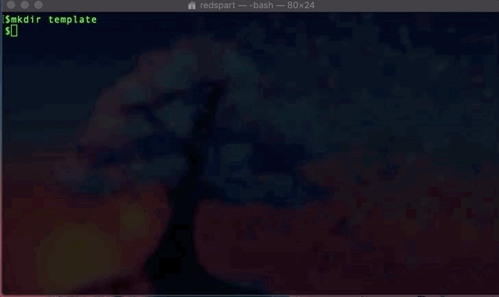

# Installation instructions

- [Requirements](#requirements)
  - [Installing VS Code](#install_vs_code)
- [Setting up and running environment](#run_env)
- [Commands used](#commands)

## Requirements

We will be using a UNIX based system such as a MAC or Linux system. You can follow the same steps, however, substitute the terminal with `CMD`.

```bash
1. Docker
2. Visual studio code insiders
3. VS code remote-development extention
```

<a name="install_vs_code"></a>

## Installing VS Code

1. Install using brew:
   

   ```bash
   brew search visual #ensure software is in there
   brew cask install homebrew/cask-version/visual-studio-code-insiders
   ```

2. Install via web by following the instructions [here](https://www.google.com/search?client=safari&rls=en&q=vscode+download&ie=UTF-8&oe=UTF-8)

<a name="run_env"></a>

## Setting up and running environment

1. Install VSCode remote development extension
   
2. Opening terminal on MAC
   
3. Make a directory to clone project in
   
   ```bash
   mkdir <directory-name>
   ```
4. `CD` into directory
   
   ```bash
   cd <directory-name>
   ```
5. `git clone`
   
   ```bash
   git clone https://github.com/cfpb/vscode-template.git
   ```
6. Open VSCODE
   
7. Open pulled project
   
8. Open project up in container
   

## Commands

```bash
# If using brew
brew search visual
brew cask install homebrew/cask-version/visual-studio-code-insiders

# Template is an example name
mkdir template
cd template
git clone https://github.com/cfpb/vscode-template.git
```
